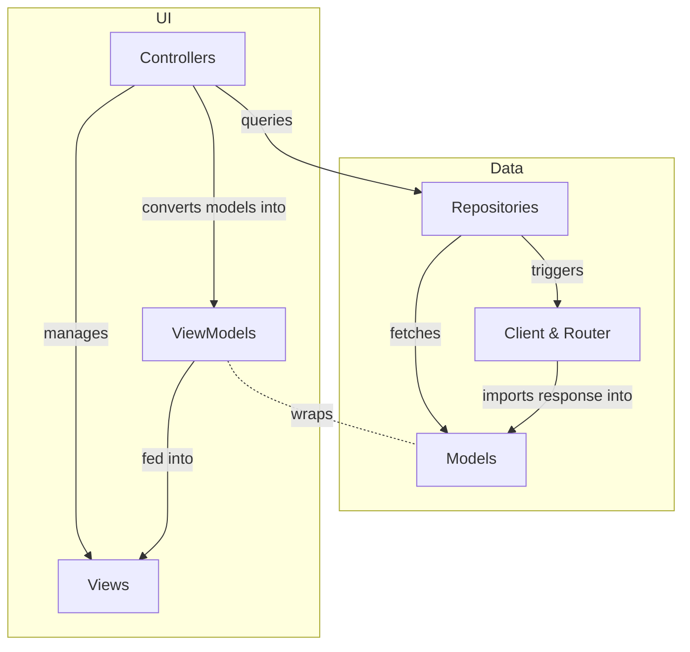

# Overview

# Model layer

- We use CoreData for this, using the built-in model editor.
- Define each property & relationship you want to store locally.
- Ideally use "nicer" versions of properties, such as enums & dates instead of strings.
- Implement functions for handling "imports" of objects.

:warning: Version your models if you need non-destructive local stores. 

# Network layer

- We use Alamofire, wich uses iOS' URLSession behind the scenes.
- For OAuth2 needs, we use the `p2/OAuth2` library.
- For each API create a separate `Router` and `Client` implemetation.
- Split these further up if you have parts of your client that are protected & unprotected by OAuth2 access tokens.

# Repository layer

- Integrates the model & network layers.
- Repositories manage "queries" for models, such as getting just 1 object, or multiple.
- Include anything that affects these queries, such as search, filter, etc…
- Should include any "operations" that modify the models, never do so directly.

# ViewModel layer

- This is a small "thin" layer around the model layer, for "presentation" purposes.
- Convert any normal property to a more "user visible" one. For example formatting a date, converting a status to a color and/or translation, etc…

:warning: To use more correct terminology from other architectures, these would probably be called "presenters".

# Controller layer

- Manages logic between presenting screens/views, and linking them with the data from repositories.
- Wraps models in ViewModel layer before using them (or passing along to View layer)
- Avoid as much as possible styling "views" in this layer, prefer creating a custom view and calling some `configure` method on it.
- Handles callbacks to trigger, for example, network refreshes or data modification.

# View layer

- Custom views, layouts & styles subviews as needed.
- Receives ViewModel instances, and sets data where needed.
- Does NOT trigger calls to repository/network layer! Use callbacks to Controller layer to do so.
- Does NOT transform data to a "presentable" state, this should be done by ViewModel layer.
